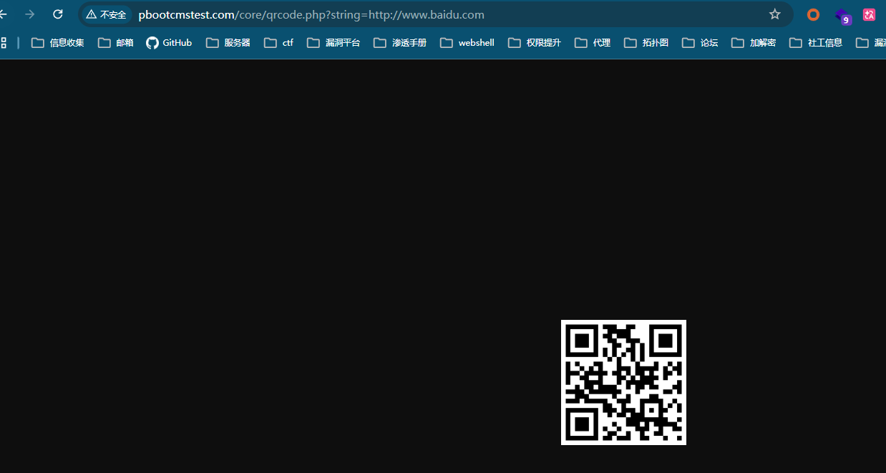

# The PbootCMS frontend has unvalidated redirect parameters that can be used to generate malicious QR code redirect links, leading to an open redirect vulnerability

PbootCMS is an open-source and free PHP content management system for enterprise website development.

Official Website: https://www.pbootcms.com/
Download Link: https://github.com/pbootcmspro/PbootCMS/releases/tag/V3.2.12

File Path: `\core\qrcode.php`. This code generates a QR code based on the URL link passed through the `string` parameter.

```php
<?php

/**
 * @copyright (C)2016-2099 Hnaoyun Inc.
 * @author XingMeng
 * @email hnxsh@foxmail.com
 * @date 2017年12月24日
 *  二维码生成
 */

// 绘制二维码图片
function draw_qcode($string)
{
    require dirname(__FILE__) . '/extend/qrcode/phpqrcode.php'; // 引入类文件
    QRcode::png($string, false, 'M', 6, 1); // 生成二维码图片
}

if (isset($_GET['string']) && $string = $_GET['string']) {
    draw_qcode($string);
} else {
    die('地址必须传入string参数！');
}
```

Scanning the QR code will redirect to the corresponding website.

Local Environment: PHP 7.3.4nts, SQLite3



Scanning the QR code redirects to Baidu


If exploited by an attacker, it could redirect to malicious links.
